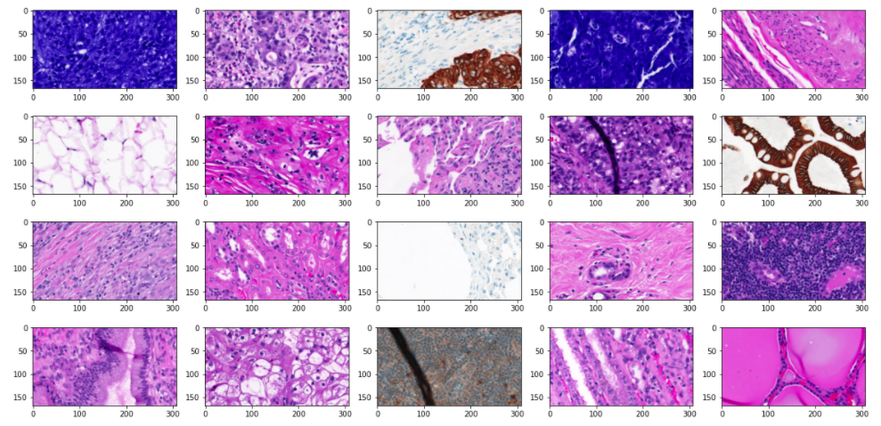

# Organization

This has 3 files（ `Database`,  `image classification  ` , `image matching` ）

* `Database` has two files, one is KIMIA which I mainly used in my research.

  

* `image matching` is different algorithms that are used to detect key points or some image processing methods.

  

* `image classification` is my undergraduate research that developed the biological tissue image discrimination model. 

  * For API, if you input a tissue image you will get the tissue name of this image.

    

    

  * And also you can get some similar tissue image which maybe useful for doctor to find the similar treatments of some tissue disease. 

    

    

  * For the research originality, I promote a new method to express an image based on the bag of visual words (BoVW) method.

